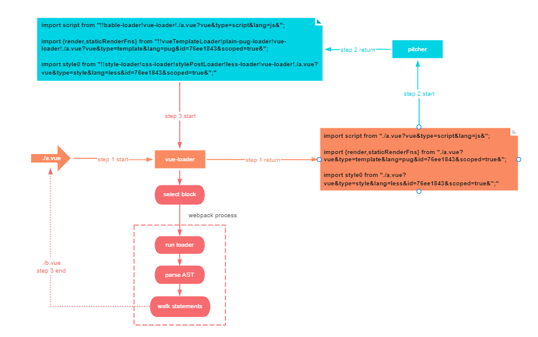
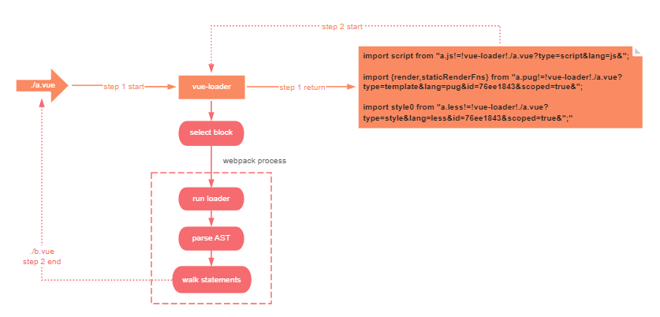

# vue-loader-matchresource
# 功能
修改了vue-loader的rules匹配策略,用webpack4 matchResource功能替代克隆Rules实现.

带来的是更直观的rules匹配策略,减少了webpack编译.vue文件生成的module数量.

出自于 [webpack PR 7462](https://github.com/webpack/webpack/pull/7462)

来两张流程图来看一下出入点:

## before


## after



# 具体实现
## 思路
1. 修改vue-loader处理后request为`!=!`语法,以便交给webpack去匹配对应rules
2. 修改vueLoaderPlugin中rules调度,以便matchResource匹配对应rules

## vue-loader
如`./a.vue?query...`,

* template处理为`a.lang!=!vue-loader!request...`lang为对应模板引擎后缀,如无就是空
* script同上,不过默认是.js
* style同上,默认.css

```javascript
//template
const fileName = src.match (/(\w+)\.vue/)[1]
const matchResource = `${fileName}${descriptor.template.attrs.lang ? '.' + descriptor.template.attrs.lang : ''}?type=template!=!vue-loader!`
const request = templateRequest = stringifyRequest (matchResource + src + query)
//script
const matchResource = `${fileName}.${descriptor.script.attrs.lang || 'js'}!=!vue-loader!`
//style
const matchResource = `${fileName}.${style.attrs.lang || 'css'}?type=style!=!vue-loader!`
```
## VueLoaderPlugin
1. 在template block中, 处理顺序为vue-loader->(模板引擎)-loader->templateLoader,因为最后要由templateLoader生成render函数.
2. 在style block中,处理顺序为vue-loader->预处理器-loader->stylePostLoader->css-loader->style-loader,故stylePostLoader应该一直确保在css-loader之前.
3. 在script block中,直接交给webpack处理js规则就可.

```javascript
        const templateLoaderRule = {
            loader: templateLoaderPath,
            resourceQuery: query => {
                const parsed = qs.parse (query.slice (1))
                return parsed.type === "template"
            }
        }
        const stylePostLoaderRule = {
            loader: stylePostLoaderPath,
            resourceQuery: query => {
                const parsed = qs.parse (query.slice (1))
                return parsed.type === "style"
            }
        }
        for (let rule of rules) {
            let loaders = rule.use
            for (let i in loaders) {
                if (loaders[i].loader === 'css-loader') {
                    loaders.splice (++i, 0, stylePostLoaderRule)
                }
            }
        }
        // replace original rules
        compiler.options.module.rules = [
            templateLoaderRule,
            ...rules
        ]
```
可以看到就是把pitcher中干的事在这里做了,确保templateLoader执行顺序在webapck rules之后,确保stylePostLoader执行在webapck rules中的css-loader之前.

# 优化
* 减少了module生成,webpack的整体流程是建立在对module对象的操作上,故module减少会优化webpack依赖构建和chunk graph生成
* 减少了rules,webpack的resolve流程确定loader是和rules中条目一一对比的,显然会减少对比次数.

在ruoyi前端框架下测试数据:

```json
//origin vue-loader
{
  "time": 38325,
  "moduleNums": 1734,
  "chunkNums": 13,
  "vueFileNums": 84,
  "vueStyleRequestNums": 66,
  "vueStylePitcherReqNums": 33,
  "vueTemplateRequestNums": 81,
  "vueTemplatePitcherReqNums": 81,
  "vueScriptRequestNums": 83,
  "vueScriptPitcherReqNums": 83
}
// matchResource  vue-loader 
{
  "time": 36903,
  "moduleNums": 1537,
  "chunkNums": 13,
  "vueFileNums": 84,
  "vueStyleRequestNums": 66,//实际style block数量33 因为css-loader会额外生成一次request
  "vueStylePitcherReqNums": 0,
  "vueTemplateRequestNums": 81,
  "vueTemplatePitcherReqNums": 0,
  "vueScriptRequestNums": 83,
  "vueScriptPitcherReqNums": 0
}
```
